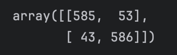

# Fake News Detection Project


## Overview

This project is an implementation of a **Fake News Detector** using Python and Machine Learning techniques. The goal is to build a model that can classify news articles as either "Real" or "Fake" based on their content. The project is inspired by the tutorial from [DataFlair](https://data-flair.training/blogs/advanced-python-project-detecting-fake-news/).

The project uses a **Passive Aggressive Classifier**, a popular algorithm for online learning, to train the model on a dataset of labeled news articles. The dataset contains text data along with labels indicating whether the news is real or fake.

## Features

- **Text Preprocessing**: Cleans and prepares the text data for analysis.
- **TF-IDF Vectorization**: Converts text data into numerical features.
- **Passive Aggressive Classifier**: A machine learning model for binary classification.
- **Accuracy Evaluation**: Measures the performance of the model using accuracy metrics.
- **Interactive Prediction**: Allows users to input a news article and get a prediction on its authenticity.

## Requirements

To run this project, you need the following Python libraries installed:

- `numpy`
- `pandas`
- `scikit-learn`
- `nltk`
- `matplotlib`
- `seaborn`

You can install the required libraries using the following command:

```bash
  pip install numpy pandas scikit-learn nltk matplotlib seaborn
```

## Project structure
```
  fake-news-detection/
  ├── idea/                    # Folder containing project ideas or brainstorming notes
  ├── data/                    # Folder containing the dataset
  │   └── news.csv             # Combined dataset of fake and real news
  ├── README.md                # Project documentation
  ├── requirements.txt         # List of dependencies
  └── sample.ipynb             # Jupyter notebook for experimentation and analysis
```

## How to Run
1. Clone the repository:
```bash
  git clone https://github.com/Frost40/Fake_News_Detector.git
  cd Fake_News_Detector
```

2. Install the required dependencies:
```bash
  pip install -r requirements.txt
```

3. Run the Jupyter notebook to explore the project and train the model:
```bash
  jupyter notebook sample.ipynb
```

## Results

The model achieves an accuracy of **92.8%** on the test dataset. Below is a confusion matrix showing the performance of the model:



## License

This project is licensed under the MIT License. See the [LICENSE](LICENSE) file for details.

## Acknowledgments

- [DataFlair](https://data-flair.training/blogs/advanced-python-project-detecting-fake-news/) for the tutorial and inspiration.
- Kaggle for providing the dataset.
